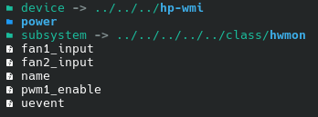

# Victus-Fan-Control

## Victus fan control extension

A native, lightweight KDE Plasma and Gnome extension for Victus laptops running Linux. let you switch between **Auto** and **Max** Fan modes directly from your taskbar—without ever opening a terminal or typing a password.


### Step 1: Force Fan Control Support

```
sudo modprobe hp_wmi force_fan_control_support=true
```
### Step 2 : Let's check if the `fan1_input` and `fan2_input` files appeared
```
ls -l /sys/devices/platform/hp-wmi/hwmon/hwmon*/
```


If these files appeared then you are good to go.

#### Now you have two options first one is use command to control Fan and second is Use my extensions if you are using KDE or Gnome.
---
### Let's go with command method first
* Max mode
```
echo 0 | sudo tee /sys/devices/platform/hp-wmi/hwmon/hwmon*/pwm1_enable
```
* Auto mode
```
echo 2 | sudo tee /sys/devices/platform/hp-wmi/hwmon/hwmon*/pwm1_enable
```
---
* Manual mode is not working in my laptop
Because firmware (BIOS + Embedded Controller) does not expose the manual fan-control interface that the hp-wmi driver needs it rejects always maybe it works in future after new BIOS update
```
echo 1 | sudo tee /sys/devices/platform/hp-wmi/hwmon/hwmon*/pwm1_enable

echo 4000 | sudo tee /sys/devices/platform/hp-wmi/hwmon/hwmon*/fan1_target
```

# Extension is coming be patient
